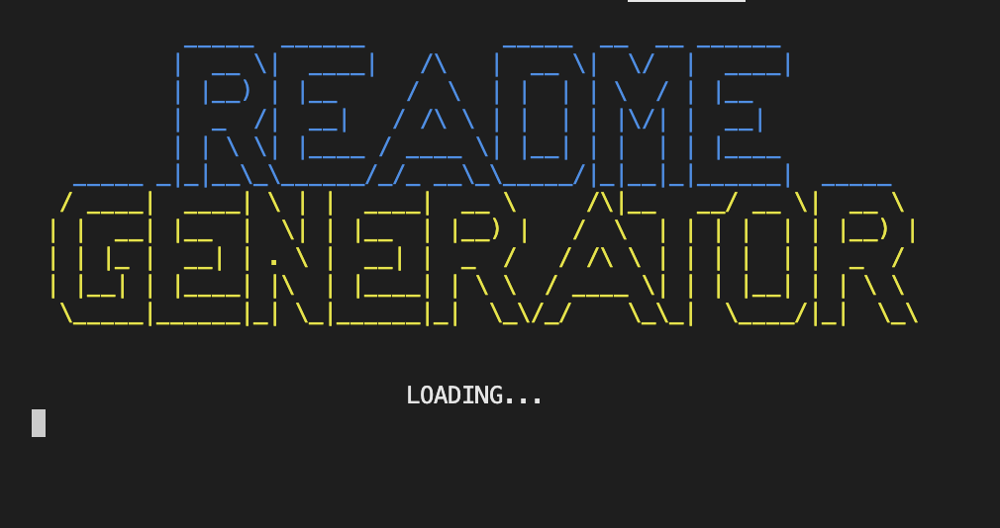
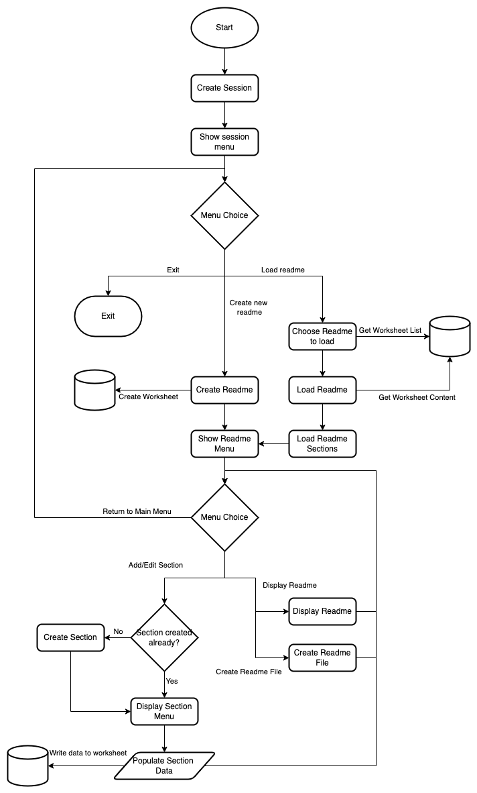
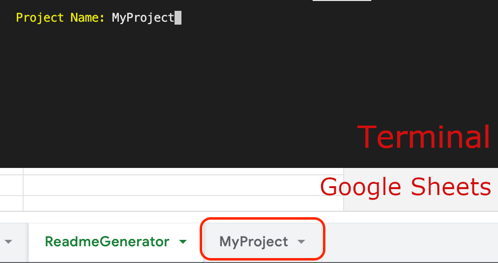
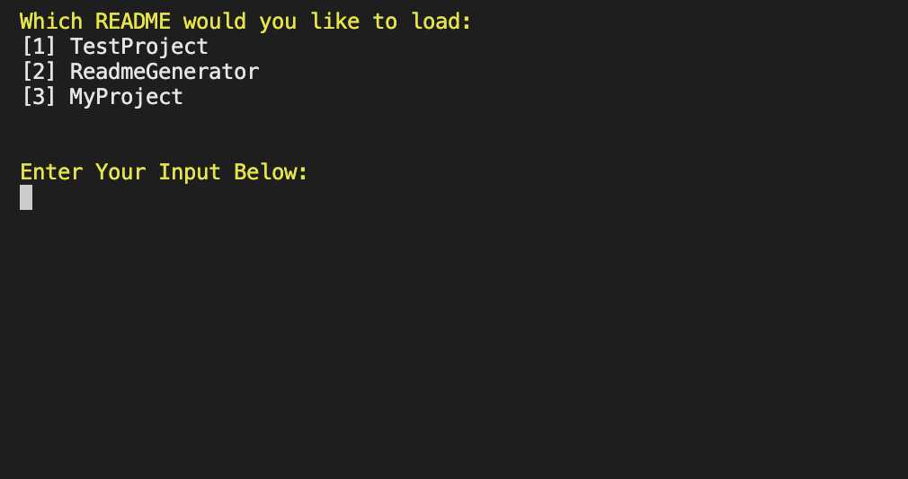
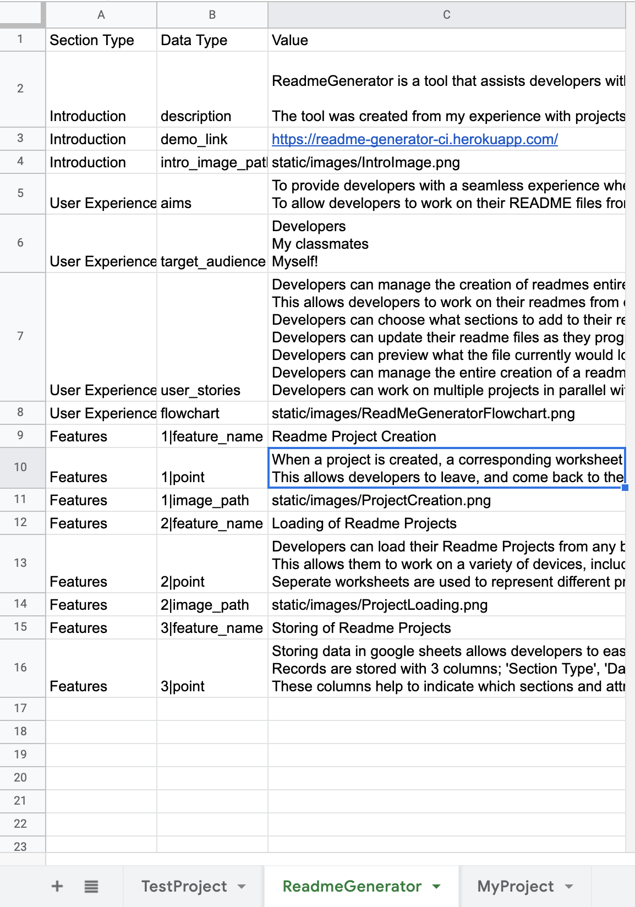
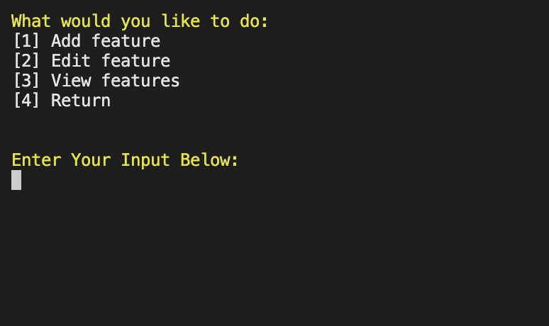
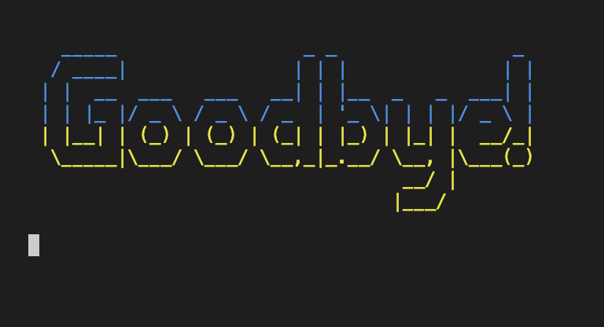

# ReadmeGenerator - Project Portfolio 3 - Python

<p align="center"></p><br />

## Introduction

ReadmeGenerator is a tool that assists developers with the creation of README.md files for their projects. It is an interactive CLI than can be ran both locally and on Heroku. The tool guides you through the README.md creation process, and automatically creates and formats a markdown structured README.md file for you. 

The tool was created from my experience with projects to date, and the sometimes tediousness of formatting READMEs in markdown. I hope that this tool can help both myself and my classmates in the future.

You can view the live project here: <a href='https://readme-generator-ci.herokuapp.com/' target='_blank' rel='noopener'>ReadmeGenerator - Project Portfolio 3 - Python</a>

## User Experience

### Site Aims

 * To provide developers with a seamless experience when creating readme.md files. 
 * To allow developers to work on their readme files from any browser on any machine with their content saved in a worksheet.


### Target Audience

 * Developers
 * My classmates
 * Myself!


### User Stories

|   ID | GOAL                                                                                                              | ACTION                                                                        |
|------|-------------------------------------------------------------------------------------------------------------------|-------------------------------------------------------------------------------|
|    1 | Developers can manage the creation of readmes entirely within this tool.                                          | As a user, I can create a new readme project and have it saved online         |
|    2 | This allows developers to work on their readmes from different browsers or machines.                              | As a user, I can load a previously created readme project from a worksheet    |
|    3 | Developers can choose what sections to add to their readme so that the readme is custom to their needs            | As a user, I can add a new section to my readme                               |
|    4 | Developers can update their readme files as they progress through project development                             | As a user, I can modify sections that are already added to my readme          |
|    5 | Developers can preview what the file currently would look like with the data currently entered in markdown format | As a user, I can preview my readme file in the terminal                       |
|    6 | Developers can manage the entire creation of a readme file within this tool                                       | As a user, I can request that the tool creates a populated readme file for me |
|    7 | Developers can work on multiple projects in parallel without overwriting their other project readmes              | As a user, I can switch to a different readme project                         |

### Flowchart

<p align="center"></p><br />


## Features

### Readme Project Creation:

 * When a project is created, a corresponding worksheet is created in Google Sheets
 * This allows developers to leave, and come back to their readme projects in the future if they wish

<p align="center"></p><br />


### Loading of Readme Projects:

 * Developers can load their Readme Projects from any browser and continue working. 
 * This allows them to work on a variety of devices, including mobile devices.
 * Seperate worksheets are used to represent different projects

<p align="center"></p><br />


### Storing of Readme Projects:

 * Storing data in google sheets allows developers to easily pick up where they left off with their work.
 * Records are stored with 3 columns; 'Section Type', 'Data Type', 'Value'
 * These columns help to indicate which sections and attributes that pieces of data correspond to.

<p align="center"></p><br />


### Menu Helpers:

 * The menu_helpers.py file contains a set of functions that assist in the presenting of menus throughout the tool.
 * clear_screen() can clear the terminal window to reduce the amount of info on the screen at any one time
 * process_menu() shows the user various menu options that they can choose from, and ensures that appropriate input is given from the user.
 * The read_input() function (called by process_menu()) has the ability to read multiple lines of input before returning a response to the caller

<p align="center"></p><br />


### Intro Section:

 * The IntroSection class allows developers to add an introduction to their project in their Readme.
 * It prompts the user to provide a description of their project (multi line input), a demo link for their project, along with an introductory image of the project.
 * Please see the Introduction section of this readme for reference of what is generated by the tool

<a href="#introduction">Click here to see the generated Intro Section!</a>


### User Experience Section:

 * The UserExperienceSection class allows developers to outline what the intended experience users should have when using the project is.
 * This covers the subsections of 'Site Aims', 'Target Audience', 'User Stories', and a flowchart showing the flow of the tool usage. 

<a href="#user-experience">Click here to see the generated User Experience Section!</a>


### 'Features' Feature:

 * The FeaturesSection allows devlopers to breakdown their project into individual features and spotlight them to the readers of the readme. 
 * For each feature, there is a title, a collection of interesting points about the feature, and the option for an image to accompany the feature

<a href="#features">Click here to see the generated Features Section!</a>


## Future Features

### More Sections:

 * Currently, there are 3 sections implemented in this tool. However, there are many other sections that can be added in the future. 
 * Due to the unexpected complexity of this projct, I was unable to tackle all sections I would have liked to add to the tool.
 * A testing section is a common section across all readmes I've seen, and as testing is vital for the success of a project, this would certainly be the next section I'd implement if given more time. 

## Data Model

### Session Class

The Session class represents an execution of the code by a user. It is responsible for the main running of the tool. 

### Readme Class

The readme class represents the readme object being worked on. This class can be instantiaed with empty/null values when creating a new readme project, or it can be instantiated and provided data from a google worksheet. If provided with worksheet data, it will automatically create various section objects corresponding to the data provided.

### Section Class

The section class contains common functions used by all sections, such as writing content to a worksheet. This class is inherited by all section functions, so that the section functions have access to the commong functions. 

### IntroSection/UserExperienceSection/FeaturesSection Classes

The above classes represent their corresponding sections of the project. The user can populate relevant info for the sections, and the classes will then parse this data into markdown format when the user calls the output_raw() function in the readme class. Each class is able to populate its data from data provided by the worksheet

### Google Worksheets

Each worksheet in the readme_generator spreadsheet represents a different readme project. When running the tool, you can view a list of available projects to load and when selected, that project information will be queried from the corresponding spreadsheet. If a user attempts to create a project with the name of an already existing worksheet, they will be shown an error message indicating this and they will be asked to try again. 

Within the worksheet itself, data is organised into 3 columns; 'Section Type', 'Data Type', and 'Value'. 

Section Type:
 * This refers to the type of section the data belongs to. Such as Introduction, User Experience, or Features
 * Section classes use this column to determine which information belongs to them

Data Type:
 * This refers to the name of the attributes of the section class determined from the Section Type. 
 * This helps section classes to know which data needs to be assigned to which variables .

Value:
 * The value of the section attribute is specified here. 
 * The value can be a single value, or multiple lines split by newline '\n' strings. 
 * This value is populated into section class attributes once a readme project is loaded


## Testing

### Pylint results:
"Pylint is a tool that checks for errors in Python code, tries to enforce a coding standard and looks for code smells."
https://pylint.pycqa.org/en/latest/

**run.py**
```
run.py:214:15: W0703: Catching too general exception Exception (broad-except)
run.py:235:4: R0201: Method could be a function (no-self-use)

------------------------------------------------------------------
Your code has been rated at 9.81/10 (previous run: 9.81/10, +0.00)
```

**readme.py**
```
--------------------------------------------------------------------
Your code has been rated at 10.00/10 (previous run: 10.00/10, +0.00)
```

**sections/section.py**
```

--------------------------------------------------------------------
Your code has been rated at 10.00/10 (previous run: 10.00/10, +0.00)
```

**sections/intro.py**
```
--------------------------------------------------------------------
Your code has been rated at 10.00/10 (previous run: 10.00/10, +0.00)
```

**sections/user_experience.py**
```
sections/user_experience.py:1:0: C0302: Too many lines in module (1042/1000) (too-many-lines)
sections/user_experience.py:188:8: R1702: Too many nested blocks (6/5) (too-many-nested-blocks)
sections/user_experience.py:270:8: R1702: Too many nested blocks (6/5) (too-many-nested-blocks)
sections/user_experience.py:487:8: R1702: Too many nested blocks (6/5) (too-many-nested-blocks)
sections/user_experience.py:580:8: R1702: Too many nested blocks (6/5) (too-many-nested-blocks)
sections/user_experience.py:801:8: R1702: Too many nested blocks (6/5) (too-many-nested-blocks)
sections/user_experience.py:899:8: R1702: Too many nested blocks (6/5) (too-many-nested-blocks)
sections/user_experience.py:17:0: R0904: Too many public methods (27/20) (too-many-public-methods)

------------------------------------------------------------------
Your code has been rated at 9.80/10 (previous run: 9.80/10, +0.00)
```

**sections/features.py**
```
--------------------------------------------------------------------
Your code has been rated at 10.00/10 (previous run: 10.00/10, +0.00)
```

### Pycodestyle results:
"A tool to check your Python code against some of the style conventions in PEP 8."
https://pypi.org/project/pycodestyle/

**run.py**
```
run.py:48:80: E501 line too long (87 > 79 characters)
run.py:54:80: E501 line too long (96 > 79 characters)
run.py:56:80: E501 line too long (80 > 79 characters)
run.py:57:80: E501 line too long (83 > 79 characters)
run.py:58:80: E501 line too long (86 > 79 characters)
run.py:61:80: E501 line too long (90 > 79 characters)
```

**readme.py**
```
NA
```

**sections/section.py**
```
NA
```

**sections/intro.py**
```
NA
```

**sections/user_experience.py**
```
NA
```

**sections/features.py**
```
NA
```

### PEP8 Online
"Check your code for PEP8 requirements"
http://pep8online.com/

* All code has been validated on this website with the same results as pycodestyle above. 
* The reason for PEP8 errors in run.py are due to printing the start animation.
* This has not been modified as bringing the print statements into new lines would make readability of the code much more difficult.

## Deployment:

This project was deployed using Code Institute's mock terminal for Heroku.

 * Steps for deployment on Heroku
   * Fork or clone this repository
   * Create a new Heroku app
   * Set the buildbacks to Python and NodeJS in that order
   * In Settings -> Config Vars, add a config var for 'PORT' - '8000'
   * In Settings -> Config Vars, add a config var for 'CREDS' - Your google spreadsheet credentials
   * Link the Heroku app to the repository
   * Click on Deploy

* Steps for deployment on Heroku
   * Fork or clone this repository
   * Navigate into the reposity and run 'Python3 run.py'

## Bugs:

### Solved: 
 * Creating new readme projects led to data not populating on the worksheet for the project. This was fixed by ensuring the table headers were being set when a worksheet was created. Once headers were present, section classes knew how where to look for data. 
 * Data was being being sent to the worksheet each time data was being populated by the tool when loading sections. This was because code to write to the spreadsheet was in the section functions that set their corresponding variables. When data was being loaded and setting the variables, it was then writing to the worksheet and cause very slow runtimes when using the tool. This was fixed by adding a 'write_to_sheet' variable to the function arguments, which tells the fuction if it should write to the spreadsheet or not when called. Value is True, when a user is setting values, and False when loading from the spreadsheet.
 * There were lots of issues in importing the section classes into other classes since they were in a different folder to run.py and readme.py. This was solved by creating an __init__.py file inside the folder, and adding import commands for the classes inside the __init__.py file. 

### Remaining:
 * When editing features, it is currently not possible to add/remove points of note for the feature. You can only modify points already created.
 

 ## Credits:

 * https://docs.gspread.org/en/v5.3.2/ - For interacting with Google Spreadsheets 
 * https://pypi.org/project/tabulate/ - For creating tables in markdown for user stories with the UserExperienceSection class
 * https://stackoverflow.com/questions/63882369/can-i-amend-a-commit-made-with-vscode-to-github-repo - For helping me to fix incorrect commits
 * https://stackoverflow.com/questions/517970/how-to-clear-the-interpreter-console - For clearing the terminal screen
 * https://realpython.com/iterate-through-dictionary-python/#iterating-through-items - For iterating through dictionaries
 * https://timothybramlett.com/How_to_create_a_Python_Package_with___init__py.html - For solving import issues with section classes
 * https://www.programiz.com/python-programming/inheritance - For helping to understand inheritance 
 * https://stackoverflow.com/questions/30239092/how-to-get-multiline-input-from-user - For multi line input from users
 * https://pypi.org/project/colorama/ - For changing the color of text
 * https://realpython.com/python-enumerate/ - For learning enumerate() 
 * https://patorjk.com/software/taag/ - For ascii art 

 ## Acknowledgements

 The ReadmeGenerator was built as part of my Portfolio Project 3 (Python) on behalf of a Full Stack Software Developer Diploma at the Code Institute. I'd like to thank the inspiration for this website from my mentor Richard Wells, as well as the Slack community and everyone at the Code Institute for their help and loving support. I'd like to especially thank my partner Dan for all of his loving support throughout the creation of this project. I couldn't have done it without being able to run my questions/issues by him.
 
 Creating this tool has taught me a lot, and I'm now much more confident in my abilities when it comes to planning, building, testing, and deploying a fully working app based on Python.

 <p align="center"></p><br />